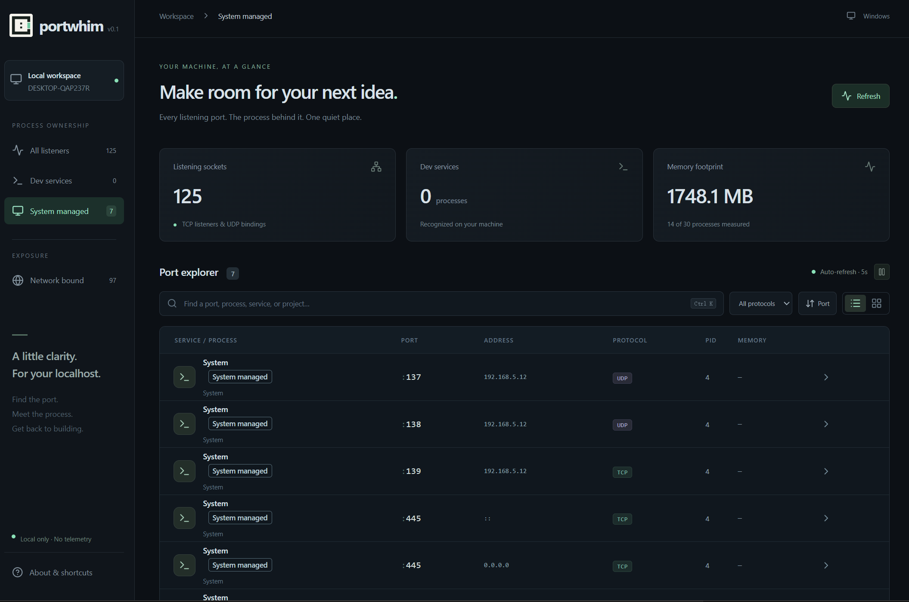
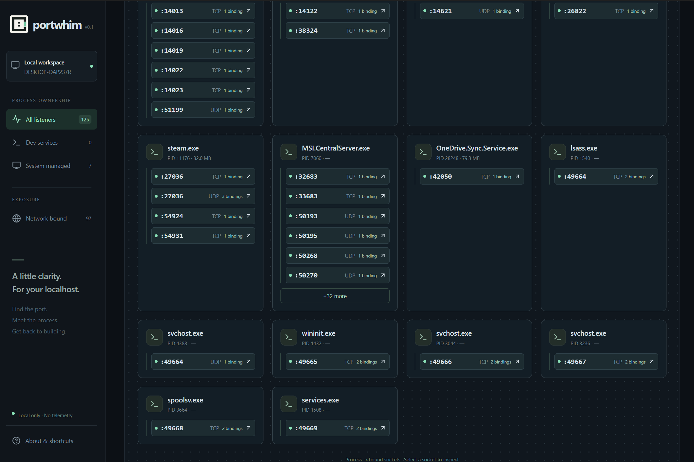

<div align="center">
  
  <h1>Portwhim</h1>
  <p><strong>找到端口，找到项目，继续开发。</strong></p>
  <p>在一个桌面窗口里，看清本机正在运行的服务。</p>
  <p><a href="README.md">English</a> · <a href="#开始使用">开始使用</a> · <a href="#日常使用">使用指南</a> · <a href="#参与贡献">参与贡献</a></p>
</div>

开发服务器报了 `EADDRINUSE`，任务管理器里却有好几个 `node`：哪个是今天的项目，哪个是昨天忘关的服务？到底该停哪一个？

**Portwhim 将本机端口、占用进程和可识别的项目关联起来。** 你可以查看占用者、打开项目目录、检查同进程的其他端口，再确认停止，省去在多个窗口和命令之间来回查找。

使用 **Tauri 2 · Rust · React · TypeScript** 构建。本地运行，无需账户，没有遥测。[MIT 开源](LICENSE)。

## 界面预览

**端口列表** — 在同一张列表中查看端口、绑定地址、协议和占用进程。下图选中了 **System managed** 筛选，展示系统管理进程的端口绑定。



**进程视图** — 按进程归组展示端口、TCP/UDP 协议和绑定数量；展开卡片即可查看更多端口。



## 什么时候会用到？

| 遇到的问题 | Portwhim 能帮你做什么 |
| --- | --- |
| “3000 端口已经被占用了。” | 精确找到端口，核对进程身份，停止不需要的进程并查看复查结果。 |
| 同时开着多个仓库和开发服务器。 | 按项目名或目录搜索，直接打开识别到的项目文件夹。 |
| 好几个进程都叫 `node` 或 `python`，分不清是谁。 | 结合服务识别、项目依据、启动时间和可见父进程链判断归属。 |
| 怀疑之前的开发服务没关，一直占着资源。 | 筛选 **Dev services**，按内存排序，查看详情后决定是否结束。 |
| 刚停止的服务又出现了。 | 查看扫描摘要中的占用者变化，再检查可见的启动来源。 |
| 想检查服务究竟绑定了哪个地址。 | 集中查看回环、所有网卡和特定网络地址，包含 IPv4 / IPv6。 |

## 为什么选择 Portwhim？

### 不止知道 PID，还能找回项目

进程名往往不能告诉你应该回到哪个仓库。Portwhim 从可访问的本地路径查找项目标记，展示推断的项目、目录和识别依据；通过 **Open folder** 打开项目，或用 **Copy path** 复制路径继续排查。

### 查看、操作、复查，在同一个流程里完成

停止前先看同进程的其他端口和资源信息。Portwhim 会校验进程身份，并通过原生对话框确认；操作后重新扫描，告诉你目标是否仍被观测到、端口是否已从扫描中消失，或者是否换了另一个占用者。

### 适合在开发时随手查看

精确端口搜索、项目搜索、组合筛选、进程卡片和五秒刷新，方便同时观察多个服务。最新变化摘要提示端口新增、消失和占用者变化，可以随时关闭。

### 数据在本机处理，应用复用系统 WebView

采集和项目识别在本机 Rust 层完成，原始命令行不传入界面。桌面应用使用 Tauri 与系统 WebView；运行构建好的应用不需要安装 Node.js 或 Rust 开发工具。

### 与常见工具如何搭配？

| 工具或方式 | 适合做什么 | Portwhim 的侧重点 |
| --- | --- | --- |
| `netstat`、`ss`、`lsof` | 终端排查、脚本自动化 | 将“端口 → 进程 → 项目”变成可浏览的操作流程 |
| 任务管理器 | 整机进程和资源观察 | 从正在阻碍开发的那个端口开始查找 |
| 端口释放命令 | 快速停止已经确认的目标 | 停止前查看上下文，操作后查看扫描反馈 |

这是使用方式的比较，不代表 Portwhim 在所有场景都更快或功能更多。它专注于本机开发排障，目前没有脚本调用接口、抓包或远程主机管理功能。

## 开始使用

### 运行已经构建好的应用

如果你已有本项目生成的 Windows 安装包，安装后启动 **Portwhim** 即可，无需安装开发工具。Windows 需要 WebView2；缺失时安装包会联网下载，离线电脑需要预先安装。

当前仓库文档尚未提供公开发行版下载链接。Windows 是主要验证平台；macOS/Linux 已有适配和 CI 配置，仍需对应平台验证。测试范围和 Windows 签名状态见 [验证记录](VALIDATION.md)。

### 从源码启动

准备 **Node.js 24**、**pnpm 11**、**稳定版 Rust**，并安装对应系统的 [Tauri 构建依赖](https://v2.tauri.app/start/prerequisites/)。Windows 需要 Microsoft C++ Build Tools 和 WebView2；macOS 需要 Xcode Command Line Tools；Linux 需要对应发行版的原生开发依赖。

下载或克隆仓库，在项目根目录打开终端，执行：

```sh
pnpm install
pnpm dev
```

使用自动打开的桌面窗口，普通浏览器页面不能调用本机采集能力。首次构建需要编译 Rust 依赖，可能耗时较长。

需要构建独立桌面程序并启动时：

```sh
pnpm run pack
pnpm start
```

## 日常使用

### 处理 3000 端口冲突

1. 打开 **All listeners**，按 `Ctrl+K` / `⌘K` 聚焦搜索。
2. 输入 `3000`、`:3000` 或 `port:3000`，精确匹配该端口。
3. 点击结果，核对进程、项目、启动时间和其他关联端口。
4. 确认是不再需要的进程后，选择 **Stop process**，在原生对话框中确认。
5. 阅读复查结果，再重新启动开发服务器。

停止会结束**整个进程**，影响它的全部端口，也可能丢失未保存的工作。Windows 立即终止，Unix 发送 `SIGTERM`，不会继续强制结束。系统管理、受保护及身份无法核实的进程不能停止。如果服务被管理工具重新拉起，请回到对应工具停止它。

### 找到服务所属的项目

搜索项目名、目录、服务或进程名，在详情的 **Project & launch origin** 中查看推断目录、依据和父进程链。通过 **Open folder** 返回项目，或通过 **Copy path** 复制位置。

项目归属由可获取路径和 `package.json`、`pyproject.toml`、`Cargo.toml`、`go.mod`、`composer.json`、`.git` 等标记推断。缺少依据时显示 **Unknown**；父进程链描述当前可见关系，并非完整启动历史。

### 集中查看正在运行的服务

| 控件 | 用途 |
| --- | --- |
| **Dev services** | 规则识别的开发服务，排除系统管理进程 |
| **System managed** | 被分类为由操作系统管理的进程 |
| **Network bound** | 非回环地址绑定；不代表已经暴露到公网 |
| **TCP / UDP** | 按协议筛选，可与搜索及当前分类组合 |
| **Port / Memory** | 按端口升序或进程 RSS 内存降序排列 |
| **Process map** | 用卡片归组展示进程的端口及地址绑定 |
| **Refresh / Pause** | 手动扫描或控制五秒自动刷新 |

点击端口或 PID 即可复制，按 `Esc` 关闭详情。文字查询为模糊匹配，但纯数字始终作为精确端口查询，不用于查询 PID。搜索时已有筛选条件继续生效。

**Open localhost** 仅对具有已识别 Web 服务特征或支持的 Web 端口、且可通过回环地址访问的 TCP 绑定开放。它选择 HTTP/HTTPS 和回环地址；数据库、UDP、仅局域网绑定及协议依据不足的条目会禁用并说明原因。入口可用只代表符合推断规则，不代表已成功连接服务。

<details>
<summary>如何理解数字和扫描反馈</summary>

- **Listening sockets** 统计 TCP 监听和 UDP 绑定条目，不是不同端口号的数量；UDP 没有 TCP 式监听状态。
- 顶部 **Dev services** 按 PID 统计进程数，侧栏统计 socket 条目数。
- **Memory footprint** 对完整扫描中已知 RSS 按 PID 去重汇总，不是整机内存占用。同进程的多行条目共享资源数值。
- CPU 为采样值，首轮不可用，采样间隔可能与任务管理器不同；缺失信息显示 `—`。
- 服务识别覆盖常见 Next.js、Vite、Laravel、Node.js、Python、PostgreSQL、Redis、MySQL 和 Docker 特征；**port hint** 仅为未验证的端口提示。Docker 识别不包含容器清单或端口映射归属。
- 变化摘要比较成功扫描，保留最新一批变化，可关闭；不保存历史，也不发送系统通知，扫描间隙的变化可能被遗漏。
- 空列表或停止后的“已释放”描述的是当时观测到的绑定，不保证随后启动服务一定能绑定成功。

</details>

<details>
<summary>常见问题</summary>

- **没有结果？** 清空搜索并重置筛选，然后刷新。先检查扫描错误和权限限制，再判断是否没有服务运行。
- **Desktop connection unavailable？** 使用 `pnpm dev` 启动桌面应用，或先 `pnpm run pack` 再 `pnpm start`。单独的 `pnpm build` 只构建前端。
- **停止按钮不可用？** 查看详情中的具体原因。身份数据不足、受保护及系统管理进程会禁用停止；过期选择需要刷新后重选。
- **扫描失败？** 点击重试。首次失败显示独立错误状态；已有成功扫描时，保留旧快照并提示错误。
- **项目未知？** 可获取的进程路径可能不包含可访问的项目标记。项目识别尽力提供线索，并非完整仓库清单。

</details>

## 参与贡献

不需要先读懂整个项目才能参与。文档修正、可复现的问题反馈和小范围 PR 都很有帮助。

可以从这些地方开始：

- **文档与上手体验**：解释一个不清楚的步骤，补充真实排障案例。
- **React / TypeScript**：改进键盘操作、筛选和进程详情体验。
- **Rust**：完善服务识别与项目归属，并为误判情况补充测试。
- **平台验证**：在 macOS 或 Linux 上试用，记录系统版本、步骤和实际结果。

反馈问题时说明预期、实际表现和复现步骤。较大的功能建议先开 issue 讨论使用场景，再投入实现。环境配置、按改动范围选择的验证步骤和源码入口见 [贡献指南](CONTRIBUTING.md)。

## 开发命令

| 命令 | 作用 |
| --- | --- |
| `pnpm dev` | 打开 Tauri 开发窗口 |
| `pnpm build` | 检查类型并构建前端 |
| `pnpm test:frontend` | 运行前端逻辑测试 |
| `pnpm test` | 运行前端和 Rust 测试；真实进程测试需单独执行 |
| `pnpm test:live` | 运行自行创建的 TCP/UDP 临时进程集成测试 |
| `pnpm run pack` | 构建生产桌面程序，不生成安装包 |
| `pnpm start` | 启动 `pnpm run pack` 生成的程序 |
| `pnpm dist` | 构建对应平台安装包 |

生产程序位于 `src-tauri/target/release`，安装包位于其 `bundle` 目录。请使用 `pnpm run pack`；`pnpm pack` 是包管理器生成源码 tarball 的另一条命令。

实际检查过的范围见 [验证记录](VALIDATION.md)。上方预览采用提供的 Windows 应用截图。旧文件 `docs/screenshot.png` 和 `docs/process-map.png` 早于 Tauri 迁移，保留作历史参考。

## 许可证

[MIT](LICENSE) © Portwhim contributors.
