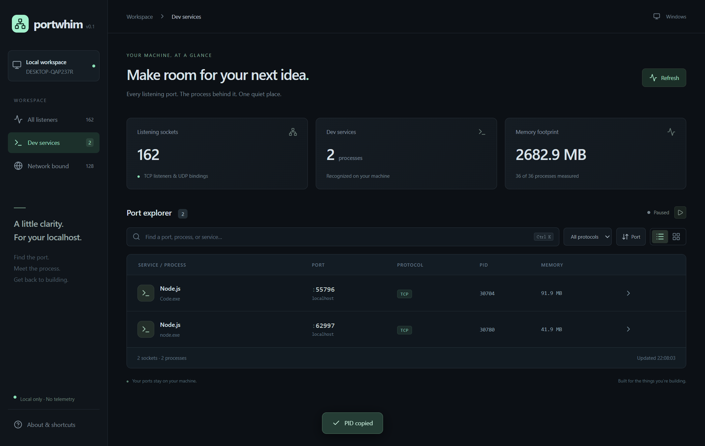
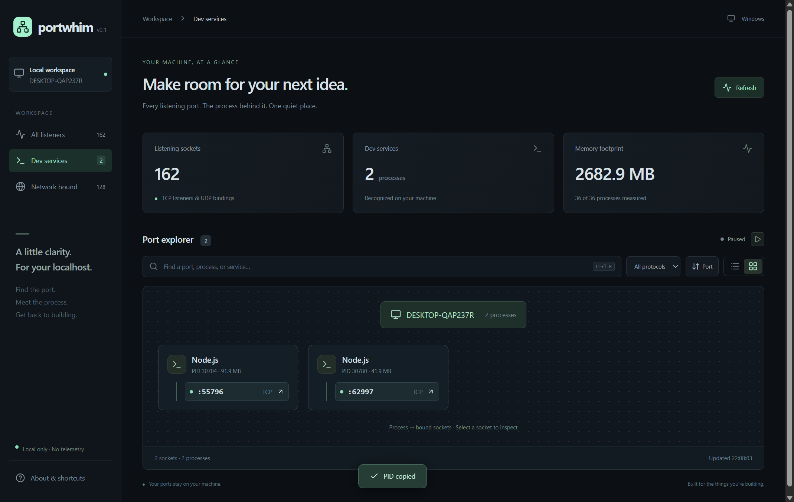

<div align="center">
  
  <h1>Portwhim</h1>
  <p><strong>端口被谁占了？打开就知道。</strong></p>
  <p>查看本机端口，找到背后的进程，让 localhost 重新井井有条。</p>
  <p>Electron · React · TypeScript · 本地运行 · MIT</p>
  <p><a href="#快速开始">快速开始</a> · <a href="#使用指南">使用指南</a> · <a href="#为什么选择-portwhim">为什么选择 Portwhim</a> · <a href="README.md">English</a></p>
</div>



## Portwhim 是什么？

Portwhim 是面向开发者的**本机端口与进程管理桌面工具**。它将 TCP 监听端口、UDP 绑定、进程身份和资源占用放在同一个界面中，支持搜索、筛选、进程关系查看，以及确认后停止进程。

当开发服务器报出 `EADDRINUSE`，你不必反复查端口、记 PID、切换到进程管理器：搜索端口，检查进程详情，再决定打开服务还是停止它。

适合经常同时运行前端、后端、数据库和脚本服务的开发者，也适合想用图形界面理解本机服务的新手。

> 当前版本为 **0.1.0**，界面为英文。Windows 已有本地验证记录；macOS、Linux 已有采集适配和打包配置，仍需对应平台验证。详见 [验证记录](VALIDATION.md)。

## 为什么选择 Portwhim？

### 少切换几个窗口，少猜几个进程

- **端口冲突找得到来源**：按端口、PID、进程名、服务名或绑定地址搜索，直接进入进程详情。
- **多个开发服务看得清楚**：识别 Next.js、Vite、Laravel、Node.js、Python，以及 PostgreSQL、Redis、MySQL、Docker 的常见进程或命令特征。
- **一个进程占了几个端口，一起看**：进程视图按 PID 汇总端口，详情面板列出同进程的其他 socket，停止前可以先看影响范围。
- **资源信息不用另找**：在可获取时展示进程启动时间、CPU、常驻内存（RSS），支持按内存从高到低排序。
- **常用操作就在旁边**：点击复制端口或 PID，为 TCP 条目打开 localhost，经过原生确认后停止进程。
- **数据留在本机**：无需账户，没有云后端、遥测或远程端口探测；原始命令行仅在主进程中用于识别，不传入界面。

### 与其他方案如何取舍？

下表比较的是常见使用方式，不是性能基准，也不代表每款同类工具的完整能力。

| 方案 | 更适合的任务 | Portwhim 的侧重点 |
| --- | --- | --- |
| `netstat` / `ss` / `lsof` 等命令行工具 | 终端排查、脚本和自动化 | 将端口、进程详情、筛选和操作整合为可浏览的桌面工作流 |
| 任务管理器、系统活动监视工具 | 查看整机进程与资源情况 | 从一个端口出发，追到进程及其其他端口 |
| 端口释放类命令行工具 | 已知目标后快速结束占用者 | 先查看名称、启动时间、资源和关联端口，再确认停止 |
| 网络扫描与抓包工具 | 主机探测、连接分析、数据包排查 | 专注本机监听与绑定的归属，适合日常开发排障 |

Portwhim 的优势是**把日常端口排障需要的信息和动作放在一起**。它使用 Electron，应用包包含桌面运行时，体积不会像原生单文件命令行工具一样小；目前也没有命令行自动化接口。

## 快速开始

### 从源码运行

准备 **Node.js 24** 和 **pnpm 11**，与项目贡献指南和 CI 配置保持一致。获取仓库源码并进入项目根目录后运行：

```sh
pnpm install
pnpm dev
```

命令会启动开发服务器和 Portwhim 桌面窗口。**请使用自动打开的桌面窗口**：在普通浏览器中访问 Vite 地址，无法读取本机进程数据。首次扫描可能需要几秒钟。

如果只想运行生产构建：

```sh
pnpm build
pnpm start
```

`pnpm start` 使用已生成的构建文件；首次运行或修改源码后，应先执行 `pnpm build`。

### 使用已构建的 Windows 应用

如果你拿到维护者提供的 Windows 构建包：

- **Portable `.exe`**：直接运行，无需另装 Node.js。
- **解压版 ZIP**：先解压整个文件夹，再运行其中的 `Portwhim.exe`。请保留旁边的运行库和 `resources` 目录，不要只移动 exe。

当前仓库没有配置公开下载地址；以上说明不表示已经发布 GitHub Release。本地验证过的 Windows 构建未签名，当前没有自动更新功能。

## 使用指南

### 1. 解决“3000 端口被占用”

1. 打开 Portwhim，等待首次扫描完成。
2. 按 `Ctrl+K`（macOS 为 `⌘K`），输入 `3000`。搜索是文本匹配，请确认结果的 **PORT** 列确实是目标端口。
3. 点击对应行或右侧箭头，打开 **PROCESS INSPECTOR**。
4. 核对进程名称、PID、启动时间，以及 **Other sockets in this process** 中列出的其他端口。
5. 如果它是你要继续使用的 Web 服务，点击 **Open localhost**；如果确认是不再需要的进程，点击 **Stop process**，在系统确认框中确认。
6. 查看刷新后的结果，再启动你的开发服务器。

**停止的是整个进程，不是单独释放某个端口。** 该进程退出后，其所有端口都会关闭，未保存的工作可能丢失。Windows 会立即终止进程；macOS/Linux 发送 `SIGTERM`，进程可能延迟退出或忽略信号。Portwhim 不会继续强制结束，也不会终止整个进程树。

### 2. 看清当前运行了哪些服务

| 界面入口 | 作用 |
| --- | --- |
| **All listeners** | 查看 TCP 监听端口与 UDP 本地绑定，包含 IPv4 / IPv6 |
| **Dev services** | 查看识别到的应用、数据库和容器相关条目；它是规则分类，不是完整项目清单 |
| **Network bound** | 查看非回环绑定，包括所有网卡和特定网络地址 |
| 搜索框 | 匹配端口、PID、进程、服务和地址，不区分大小写 |
| **All protocols / TCP / UDP** | 按协议筛选 |
| **Port / Memory** | 在端口升序与进程内存降序之间切换 |
| 列表 / **Process map** 图标 | 切换逐端口列表和按进程归组的卡片 |

搜索、侧栏分类和协议筛选可以组合使用；切换到进程视图后，仍然应用当前筛选条件。



### 3. 查看详情、复制信息和刷新

- **项目与启动来源**：详情中的 **Project & launch origin** 展示推断的项目名、目录、识别依据、直接父进程与最多 12 层父进程链。搜索支持项目名和目录。
- **识别范围**：从进程或直接父进程的绝对命令路径向上查找 `package.json`、`pyproject.toml`、`Cargo.toml`、`go.mod`、`composer.json` 或 `.git`，跳过 `node_modules` 内的依赖包；Node 项目优先显示包名。Linux 还读取可访问的 `/proc/PID/cwd`。Windows/macOS 不保证能取得工作目录，仅有相对路径时可能显示未知。
- **来源的含义**：启动来源来自当前可见的父进程链，如 shell、编辑器或服务管理器，不是历史启动记录；父进程退出、权限不足或 PID 已复用时可能不可用。项目归属属于推断，不等同于已验证所有权；原始命令行不会传入界面。

- **查看详情**：点击一行，查看绑定地址、作用范围、启动时间、CPU、RSS 内存和识别依据。
- **复制信息**：点击列表中的端口或 PID；详情中也有复制入口。
- **打开服务**：详情中的 **Open localhost** 为 TCP 条目打开 `http://localhost:端口`；IPv6 回环地址使用 `http://[::1]:端口`。UDP 不支持该操作。
- **自动刷新**：默认每 5 秒请求扫描一次，正在扫描时不重复发起；点击暂停图标可暂停，点击播放图标恢复。
- **手动刷新**：点击 **Refresh**，暂停自动刷新时也可以使用。扫描失败时会提示错误并保留上次成功的数据。
- **关闭面板**：按 `Esc` 关闭详情或 About 对话框。

### 4. 正确理解界面中的数字和标签

| 信息 | 含义 |
| --- | --- |
| **Listening sockets** | TCP 监听与 UDP 绑定条目的数量，不是进程数量，也不是不同端口号的数量 |
| **Dev services** 顶部卡片 | 识别到的相关进程数，按 PID 去重；侧栏同名计数是条目数 |
| **Memory footprint** | 当前扫描中有内存数据的进程 RSS 总和，按 PID 去重；不是整机内存占用 |
| 每行 CPU / Memory | 属于进程，同进程的多个端口共享这些数值，不应逐行相加 |
| **port hint** | 仅由常用端口推测的服务，例如 5432 → PostgreSQL，未验证服务身份 |
| **Process / command signature** | 根据进程名或命令特征识别，属于启发式判断 |
| **— / Unavailable** | 操作系统未提供该字段，不代表数值为零 |

## 常见问题

### 没有数据显示，或提示 Desktop connection unavailable？

请确认打开的是 Electron 桌面窗口，而非浏览器中的开发页面。源码方式使用 `pnpm dev`，或先 `pnpm build` 再 `pnpm start`。

如果只是没有匹配项，先清空搜索、选择 **All listeners** 和 **All protocols**，再点击 **Refresh**。仍为空时，检查扫描提示、系统权限和工具是否可用；空列表不能证明电脑上没有服务。

### 为什么进程信息不全，或 Stop process 按钮不可用？

普通账户可能无法获取其他用户的进程信息，受限运行环境也可能影响采集。应用不会自动申请管理员权限。对于受保护或身份信息不足的进程，停止按钮会禁用。

停止操作会在确认前和执行前核对 PID、名称与启动时间。遇到 **Selection expired** 或进程已变化的提示，请刷新后重新选择。该校验用于降低误操作风险，不等同于操作系统级原子身份保证。

### 为什么 Open localhost 打不开？

端口存在不表示它提供 HTTP 服务。数据库、HTTPS 服务或只绑定某个局域网地址的服务，可能无法通过这个快捷入口访问。请按服务的实际协议和绑定地址使用对应客户端。

### Network bound 表示已经暴露到公网吗？

不是。它只表示绑定地址不是回环地址；是否能从其他机器或公网访问，还取决于防火墙、路由和网络配置。Portwhim 不进行公网暴露检测。

### 为什么停止后进程或端口又出现了？

进程管理器、开发工具或服务管理器可能自动重启它。Unix 上的进程也可能没有响应 `SIGTERM`。请检查启动它的工具；Portwhim 不提供自动重启抑制或强制结束功能。

### 能管理 Docker、远程服务器或网络连接吗？

当前 Docker 标签只识别宿主进程特征，没有容器清单、端口映射归属查询或容器停止操作。进程图展示的是**本机进程与绑定端口的所属关系**，不展示远端连接、流量或数据包，也不支持 SSH 远程主机。

### CPU 数值为什么与任务管理器不同？

CPU 采样采用底层系统信息提供方的口径，采样周期可能与任务管理器不同，首次采样也可能不够稳定。它用于辅助观察，不是性能分析器。

## 平台支持

| 平台 | 当前实现 | 验证状态 |
| --- | --- | --- |
| Windows | 通过 `systeminformation` 获取系统端口与进程元数据；Portable 打包配置 | 已有真实扫描、测试进程停止、桌面交互和解压版运行记录 |
| macOS | 采集适配与 DMG 打包配置 | 尚需 Mac 真机验证 |
| Linux | 采集适配与 AppImage 打包配置 | 尚需 Linux 真机验证 |

Unix 系统依赖采集库使用的系统工具，例如 `ps`、`ss` / `netstat` 或 `lsof`，具体依平台而定。已有 CI 配置覆盖三个系统，但配置存在不代表所有平台已经通过验证。历史验证环境与范围见 [VALIDATION.md](VALIDATION.md)。

## 开发与打包

### 常用命令

```sh
pnpm install       # 安装依赖
pnpm dev           # 启动桌面开发环境
pnpm test          # 运行识别、筛选与身份保护等核心测试
pnpm test:live     # 创建临时 TCP/UDP 测试进程，验证扫描和停止
pnpm build         # TypeScript 检查并构建前端与 Electron 入口
pnpm start         # 运行已有生产构建
pnpm run pack      # 构建未封装的桌面应用目录，输出到 release/
pnpm dist          # 构建当前目标平台的分发包，输出到 release/
```

注意使用 **`pnpm run pack`**：`pnpm pack` 是包管理器生成源码 tarball 的另一条命令。

建议在对应目标操作系统上打包。Windows 默认目标为 Portable，macOS 为 DMG，Linux 为 AppImage。macOS 公开分发需另行配置 Developer ID 签名和公证；仓库不包含签名凭据。

真实集成测试只停止它自行创建的临时进程，不会以已有用户进程为目标。运行需要正常的本机进程访问权限。

### 项目结构

```text
src/main.tsx          桌面界面、搜索筛选、进程详情与关系视图
src/shared.ts        前端与原生层之间的数据和接口类型
src/style.css        界面样式
src/brand.css        品牌样式
electron/            Electron 原生层（见下）
  main.ts            窗口、调用校验、剪贴板、URL 与原生确认
  preload.ts         隔离的前端桥接接口
  scanner.ts         系统采集、数据归一化、身份复核与停止
  detect.ts          服务识别规则
scripts/             开发启动与构建脚本
tests/               核心测试与真实进程集成测试
public/brand/        品牌资产，mark.svg 为可编辑主文件
docs/                真实应用截图与品牌参考
```

界面通过有限的类型化接口请求操作，不能直接执行 shell 命令；停止请求使用扫描快照签发的条目 ID，由主进程解析目标并复核身份。窗口启用上下文隔离与沙箱，禁用 Node 集成；生产界面从本地构建文件加载。

新增服务识别规则时，请在 `electron/detect.ts` 中保持规则明确，并为误判情况添加测试。原生数据提供方留在 `electron/`，通过 `src/shared.ts` 扩展接口。

## 后续方向

以下是候选扩展，**尚未实现，也不代表发布时间承诺**：

- 项目与进程分组、自定义识别规则、偏好设置和托盘模式。
- Docker 容器清单、端口映射归属和容器级操作。
- 远端连接模型与连接关系图。
- 以快照差异推送替代定时轮询。
- 显式配置的 SSH 远程主机与优先只读的数据采集。

## 参与贡献

欢迎提交可复现的问题、改进建议和小范围 PR，开始前请阅读 [贡献指南](CONTRIBUTING.md)。

报告采集问题时，请附上操作系统及版本、复现步骤、预期结果与实际表现，并去除日志或截图中的密钥、个人路径等敏感信息。提交代码前运行 `pnpm test`、`pnpm test:live` 和 `pnpm build`，说明实际验证的平台。

## 许可证

[MIT](LICENSE) © Portwhim contributors.
